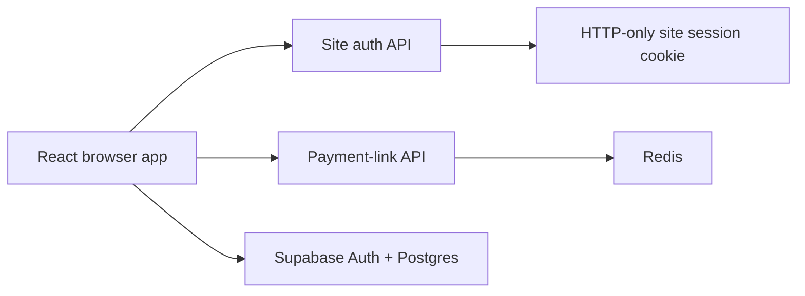

# Architecture and Data Model

## Runtime Components

### Browser Application

The React/Vite application contains the QR tools, Scenario Lab, Wallet Lab, local persistence, and
Supabase clients.

Key modules:

- `src/data/sampleProfiles.ts`: shared fictional catalog and wallet seeds.
- `src/lib/sandboxEmv.ts`: Scenario payload creation and validation.
- `src/lib/walletCloud.ts`: workspace, wallet, member, and atomic transaction APIs.
- `src/lib/scenarioCloud.ts`: shared Scenario load and publish APIs.
- `src/types/wallet.ts`: wallet, linked-account, and ledger contracts.
- `src/types/scenario.ts`: Scenario history and collaboration contracts.

### API Layer

- `api/auth.ts` manages the private site password session.
- `api/payment-links.ts` manages 15-minute shared QR lifecycle sessions.
- `server/index.ts` provides equivalent local-development endpoints with in-memory payment links.

### Supabase

Supabase provides individual collaborator identity, workspace membership, durable state, row-level
security, and atomic database functions.

### Redis

Redis stores only short-lived payment-link records. It is not the source of truth for wallet or
Scenario collaboration.

## Persistence Boundaries

| Data | Local mode | Shared mode |
| --- | --- | --- |
| Custom Scenario profiles | Browser local storage | `scenario_profiles` |
| Scenario history | Browser local storage | `scenario_transactions` |
| Wallet profiles | Browser local storage | `wallet_profiles` |
| Linked accounts | Browser local storage | `wallet_funding_sources` |
| Wallet ledger | Browser local storage | `ledger_entries` |
| Workspace members | Not applicable | `workspace_members` |
| Payment-link lifecycle | Local server memory | Redis |

## Core Tables

### `workspaces`

Defines a private sandbox and carries the shared revision used for optimistic concurrency.

### `workspace_members`

Maps Supabase users to `owner`, `editor`, or `viewer` roles.

### `wallet_profiles`

Stores the profile identity, funding model, stored-wallet balance, aggregate linked-account
balance, presentation fields, and ordering.

The aggregate `bank_balance` is retained for compatibility and display. Individual source balances
in `wallet_funding_sources` are authoritative for source-aware operations.

### `wallet_funding_sources`

Stores named linked accounts with:

- Stable source ID
- Name and account description
- Balance
- Priority
- Default flag
- Enabled flag

A partial unique index allows at most one default source per profile.

### `ledger_entries`

Stores immutable-style sandbox movements. Wallet and bank portions are separate entries, and
bank-funded entries identify the selected linked account in their detail.

### `wallet_transaction_requests`

Stores idempotency keys and completed RPC responses. A repeated request returns the original result
instead of applying the transaction again.

### `scenario_profiles`

Stores custom people and merchants as validated JSON profile documents. Built-in catalog profiles
remain application code and are not duplicated into this table.

### `scenario_transactions`

Stores completed Scenario lifecycle records. These records do not reference or mutate wallet
balances.

## Funding Behavior

### Prepaid

Payments debit stored value. Reloads move value from one selected linked account into the wallet.

### Bank-Linked and Bank-Direct

Payments debit one selected linked account. These models cannot hold stored wallet value.

### Hybrid

The transaction uses stored value first. Any remainder is debited from one selected linked account.
The operation fails if that source cannot cover the remainder, even if other linked accounts have
funds.

## Wallet QR and RTP Payloads

Wallet identity and request-to-pay QR payloads are generated in the browser as explicitly marked
`BIMPAY-SANDBOX` JSON documents. Wallet identity payloads intentionally omit balances and linked
account metadata.

An RTP request is transient UI state until approval. Approval is implemented as a wallet transfer:
the selected payer is debited, the requester is credited, and shared workspaces use
`transfer_between_wallets_from_source` for transactional consistency and idempotency.

## Multi-Branch Merchants

Merchant profiles may include a group name, branch name, branch code, and settlement model.

- `single-account` branches share an account reference and use EMV additional-data tag `62.03`
  as a store label.
- `branch-accounts` branches use distinct account references and may have independent bank-direct
  Wallet Lab profiles.

## Transaction Consistency

Shared financial RPCs use row locks and execute debit, credit, ledger, idempotency, and revision
updates in one PostgreSQL transaction. Full-state publishing is reserved for configuration changes
such as adding profiles or linked accounts.

## Upgrade Compatibility

Older single-account browser state is normalized into one primary funding source. Built-in profiles
that later gained several sample accounts preserve the existing aggregate balance by distributing
it proportionally across the new source template.
